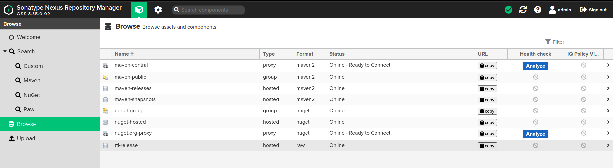
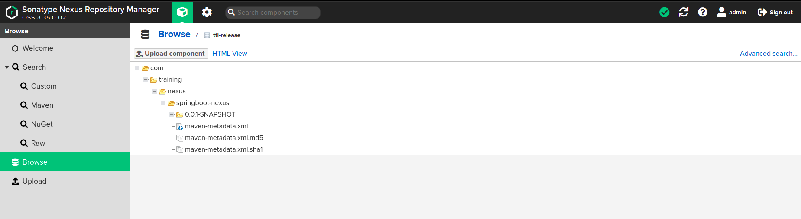

# SpringBoot Nexus Integration

Demonstrate the capabilities of deploying a springboot artefact toa self managed nexus repository instance.

[PDF Version](readme.pdf)

## Features

* Sonatype Nexus Repository Manager

## Usage

We will be spinning up a nexus instance as container and the artefcat will be deployed to nexus using maven.

### Nexus

Feel free to clone this repo and spin up a springboot instance by running

```shell
 docker build -t springboot-nexus .
```

spin up a local nexus repository container

```shell
docker run -d -p 8023:8081 --name nexus sonatype/nexus3
```
Access your repo at localhost:8023/



The username will be admin and the password can be found at 

/nexus-data/admin.password

access it by login to the container

```shell
docker exec -it nexus /bin/bash
```

Feel free to create a repo of type raw hosted to host your deployment artefatcts.

Under Administration create a privilege with repo you just created and action as comma separated read,browse,edit,add.

Under Roles create a suitable role and map the privilege created above.

Now create a user and associate the role.

Now update your maven settings.xml with the user crdentials and repo id.

```xml
    <server>
      <id>ttl-release</id>
      <username>ttl_technical_user</username>
      <password>ttluser</password>
    </server>
```

Update your pom xml to point the repo url.

```xml
	<distributionManagement>
		<repository>
			<id>ttl-release</id>
			<url>http://localhost:8023/repository/ttl-release/</url>
		</repository>
	</distributionManagement>
```

You are done. Now run

```shell
mvn clean deploy
```

Your artefacts will be deployed to the repository created.



## Note

Feel free to reach out the writer <vipinev9@gmail.com> for any queries.